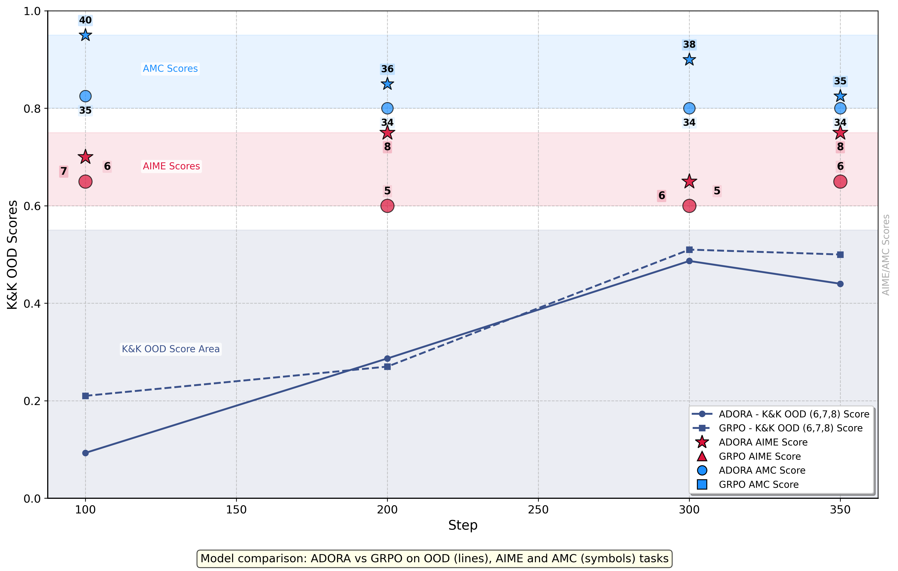

<div align="center">

# ADORA: A Scalable Paradigm for Steering Learning Trajectories

[](https://huggingface.co/AdoraRL) 
[](https://five-stetson-b51.notion.site/Steering-Model-How-to-Reinforcement-Learning-1a830cc0904681fa9df3e076b6557a3e) 
[](https://wandb.ai/luc4lj/reft-exp/reports/K-K-5ppl-GRPO-ADORA--VmlldzoxMTg3NDU5OA) 
[](https://wandb.ai/luc4lj/Qwen2.5-VL-7B-ppo-training/reports/Geometry3k-GRPO-ADORA--VmlldzoxMTg3NDQ3Mw?accessToken=t55aoj526rzc18n2kvum46vr0b6y8bjxmvbnls0829ekfezuta9l6so0bjxq7kyv) 

</div>

ADORA (Advantage Dynamics via Online Rollout Adaptation) is a reinforcement learning (RL) framework designed to dynamically adjust advantage values during training based on the model's rollout distribution. By simple yet effective experiments, it significantly improves long Chain-of-Thought (CoT) reasoning and reflective capabilities in Large Language Models (LLMs) and Vision-Language Models (VLMs). Notably, in the Logic-RL framework, our ADORA implementation in the Logic-RL framework achieves 40 AMC with only 100 training steps compared to the original paper's 39 AMC with 1200 steps, while maintaining comparable AIME performance at 8. For VLMs, using only 2K samples from the Geometry3K dataset and starting from Qwen2.5-VL-7B-Instruct, we achieved 73.5% accuracy on MathVista, with consistent response-length progression, setting a new state-of-the-art for the multimodal implementation of DeepSeek-R1-Zero. 


## News
- **[2025/03/20]** We release the blog [ADORA: A Scalable Paradigm for Steering Learning Trajectories](https://five-stetson-b51.notion.site/ADORA-A-Scalable-Paradigm-for-Steering-Learning-Trajectories-1a830cc0904681fa9df3e076b6557a3e), code repository, wandb reports and model weights.


## Key Results

### ADORA

Implementing ADORA within the Logic-RL experiments achieved 40 AMC and 8 AIME scores, surpassing the GRPO's 35 and 6 respectively.

<div align="center">

</div>

***All results in pass@1 accuracy***
|	| 2	| 3	| 4	| 5	| 6	| 7	| 8	| K&K ID	| K&K OOD	| Avg	| AIME	| AMC |
|---|---|---|---|---|---|---|---|-----------|-----------|-------|-------|-----|
|GRPO|												
|100 |	0.44|	0.42|	0.21|	0.26|	0.27|	0.17|	0.20|	0.33|	0.21|	0.31|	6|	35|
|200 |	0.39|	0.23|	0.22|	0.18|	0.21|	0.20|	0.20|	0.26|	0.20|	0.23|	5|	34|
|300 |	0.83|	0.81|	0.81|	0.64|	0.59|	0.48|	0.46|	0.77|	0.51|	0.66|	5|	34|
|350 |	0.74|	0.78|	0.78|	0.70|	0.61|	0.47|	0.41|	0.75|	0.50|	0.64|	6|	34|
|ADORA|												
|100|	0.34|	0.27|	0.21|	0.13|	0.14|	0.05|	0.09|	0.24|	0.09|	0.17|	7|	40|
|200|	0.79|	0.62|	0.67|	0.51|	0.36|	0.26|	0.24|	0.65|	0.29|	0.49|	8|	36|
|300|	0.84|	0.63|	0.67|	0.67|	0.57|	0.45|	0.44|	0.70|	0.49|	0.61|	6|	38|
|350|	0.84|	0.74|	0.73|	0.67|	0.50|	0.38|	0.42|	0.74|	0.44|	0.61|	8|	35|


### ADORA-VL

Training dynamics comparison of GRPO vs ADORA on Qwen2.5-VL-7B-Instruct (geometry3k). GRPO exhibits stagnant response length growth with KL/policy loss outliers. ADORA achieves sustained length expansion with stabilized optimization at the cost of slight training reward degradation. Benchmark results demonstrate GRPO&ADORA's superior in/out-of-domain task performance.

<div align="center">

</div>

***Data comparison of the compared approaches***

|                            | MM-EUREKA-8B | MMR1-math-v0 | Vision-R1-7B  | ADORA (ours) |
|---------------------------------|-----------|----------|------|--------------|
| Base model            | InternVL2.5-8B-Instruct      | Qwen2.5-VL-7B     | Qwen2.5-VL-7B | Qwen2.5-VL-7B         |
| Cold Start Data       | 54k (open-source)       | **None**     | 200k (Modality Bridging VLM CoT) | **None**        |
| RL Data               | 9.3k (K-12 data)      | 6k (open-source, carefully curated)    | 10k (math data) | **2k (geometry3k@ train)**         |

***All results in pass@1 accuracy***

|                            | MathVista (AVG) | MathVista(ID) | MathVista(OOD)  | MMStar |
|---------------------------------|-----------|----------|------|--------------|
| Qwen2.5-VL-7B-Instruct     | 67.3      | 69.6     | 65.5 | 63.9         |
| MM-EUREKA-8B               | 68.1      | 73.4     | 63.8 | **64.3**         |
| MMR1-math-v0               | 70.2      | 72.3     | 68.5 | 64.9         |
| Vision-R1-7B (report)      | **73.5**  | **81.9** | 66.8 | -         |
| GRPO                       | 70.2      | 71.6     | 69.1 | 61.9            |
| ADORA                      | **73.5**  | 76.1     | **71.4** | 63.8         |

## Reproducing

To reproduce the experiments of LLM and VLM in the article, you can refer to the tutorials in the `ADORA` and `ADORA_VL` folders. We conducted the experiments in an environment with 8 * A800 GPUs, and both experiments took approximately 1.5 days to complete.

## Citation

If you find this blog or our code useful, we would appreciate it if you could cite our work:

```bibtex
@misc{gui2025adora,
  title={Steering Model How to Reinforcement Learning},
  author={Lujun Gui and Qingnan Ren},
  year={2025},
  howpublished={\url{https://www.notion.so/Steering-Model-How-to-Reinforcement-Learning-1a830cc0904681fa9df3e076b6557a3e}},
  note={Notion Blog},
}
```

## Acknowledgement

We thank the [verl](https://github.com/volcengine/verl) and [OpenRLHF](https://github.com/OpenRLHF/OpenRLHF) for the awesome open-source RL infrastructure.

